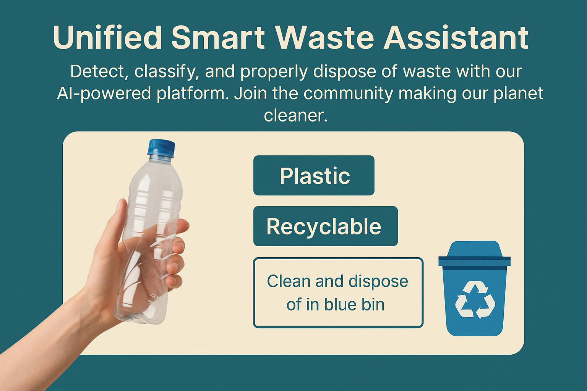

# 🌿 EcoSnap-X

**Unified Smart Waste Assistant**  
Detect, classify, and properly dispose of waste with our AI-powered platform.  
Join the community making our planet cleaner.



---

## 🚀 Features

- ♻️ **AI Waste Classifier** – Classify waste (plastic, metal, organic, etc.) using machine learning (TensorFlow.js).
- 🗺 **Geo Mapping** – Locate and visualize nearby recycling centers.
- 📷 **Image Upload** – Upload images to detect and get suggestions for waste disposal.
- 🌍 **Eco-Leaderboard** – Compete with others by submitting eco-friendly actions.
- 📊 **Realtime Stats** – See analytics on waste types and user actions.
- 🔐 **Firebase Integration** – For authentication, data storage, and real-time leaderboard.

---

## 🛠️ Built With

- **Next.js** – React-based framework for server-rendered apps
- **Tailwind CSS** – Utility-first CSS for styling
- **TensorFlow.js** – Client-side machine learning
- **Firebase** – Backend services (Firestore, Auth, Storage)
- **Google Maps API** – Map integration for recycling centers

---

## 📸 Screenshots

> _(Include some screenshots or a GIF of your app here)_

---

## 📦 Installation

```bash
git clone https://github.com/imroshanyadav/EcoSnap-X.git
cd EcoSnap-X
npm install
npm run dev
```

Then open [http://localhost:3000](http://localhost:3000) in your browser.

---

## 🧠 How It Works

1. User uploads a photo of waste.
2. TensorFlow.js classifies the item.
3. Based on the result:
   - Suggestions are shown for disposal.
   - Geo-located centers are displayed on a map.
4. Leaderboard points are awarded for submissions.

---

## 💡 Use Cases

- Educational campuses and schools
- Smart cities and local municipalities
- Green-tech awareness campaigns
- NGOs promoting sustainability

---

## 🤝 Contributing

Pull requests are welcome! For major changes, open an issue first to discuss what you’d like to change.

---

## 📄 License

MIT License. See `LICENSE` for more information.

---

## ✨ Acknowledgements

- [Next.js](https://nextjs.org/)
- [Tailwind CSS](https://tailwindcss.com/)
- [TensorFlow.js](https://www.tensorflow.org/js)
- [Firebase](https://firebase.google.com/)
- [Google Maps Platform](https://developers.google.com/maps)

---

### 🌱 EcoSnap-X – Clean Today. Green Tomorrow.
